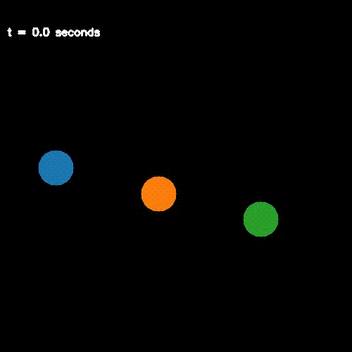

# NBODYX: Simulating N-Body Systems with Jax

This repository derives ODEs for N-Body systems and simulates them using Jax. The main goal is to provide a simple and efficient way to simulate N-Body systems using Jax.
It is heavily inspired by the amazing [ThreeBodyBot](https://github.com/kirklong/ThreeBodyBot) and specifically the [NumericsTutorial](https://github.com/kirklong/ThreeBodyBot/blob/master/NumericsTutorial/NumericalDynamicsTutorial.ipynb).



## Installation

You can install the package using `pip`:
```bash
pip install nbodyx
```
or locally in editable mode:
```bash
pip install -e .
```

For animations, we require `ffmpeg` to be installed. On Ubuntu, you can install it using:

```bash
sudo apt-get install ffmpeg
```
or using `conda`:
```bash
conda install -c conda-forge ffmpeg
```

## Usage

The following example simulates a 3-body system:

```python
from diffrax import diffeqsolve, Dopri5, ODETerm, SaveAt
import jax.numpy as jnp
from nbodyx.constants import G
from nbodyx.ode import make_n_body_ode
from nbodyx.rendering.opencv import animate_n_body, render_n_body

if __name__ == "__main__":
    body_masses = jnp.array([1.0, 1.0, 1.0]) / G
    ode_fn = make_n_body_ode(body_masses)

    # initial positions
    x0 = jnp.array(
        [
            [-0.97000436, 0.24208753],
            [0.0, 0.0],
            [0.97000436, -0.24208753],
        ]
    )
    # initial velocities
    v0 = jnp.array(
        [
            [0.4662036850, 0.4323657300],
            [-0.93240737, -0.86473146],
            [0.4662036850, 0.4323657300],
        ]
    )

    # initial state
    y0 = jnp.stack([x0, v0], axis=0).reshape(-1)
    # external torques
    tau = jnp.zeros((6,))

    # state bounds
    x_min, x_max = -1.5 * jnp.ones((1,)), 1.5 * jnp.ones((1,))

    # simulation settings
    duration = 6.3259
    ts = jnp.linspace(0.0, duration, 1001)
    dt = ts[-1] * 1e-4

    # solve the ODE
    ode_term = ODETerm(ode_fn)
    sol = diffeqsolve(ode_term, Dopri5(), ts[0], ts[-1], dt, y0, tau, saveat=SaveAt(ts=ts), max_steps=None)
    # extract the solution
    y_bds_ts = sol.ys.reshape((len(ts), 2, 3, 2))  # shape: (timesteps, 2, num_bodies, num_dims)

    # animate the solution
    animate_n_body(
        ts,
        x_bds_ts=y_bds_ts[:, 0, ...],
        width=500,
        height=500,
        video_path="examples/outputs/three_body.mp4",
        speed_up=ts[-1] / 10,
        x_min=x_min,
        x_max=x_max,
        timestamp_unit="s",
    )
```
